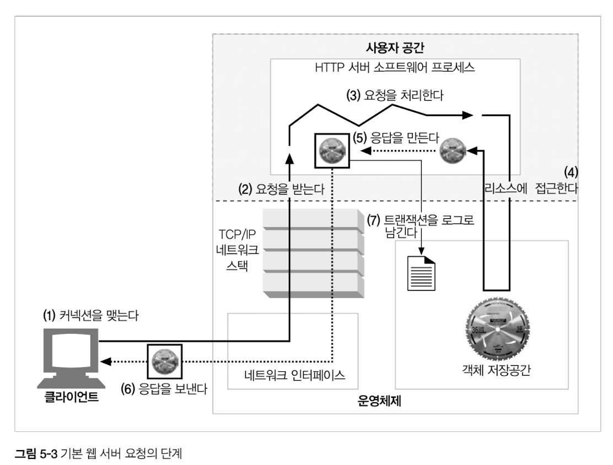
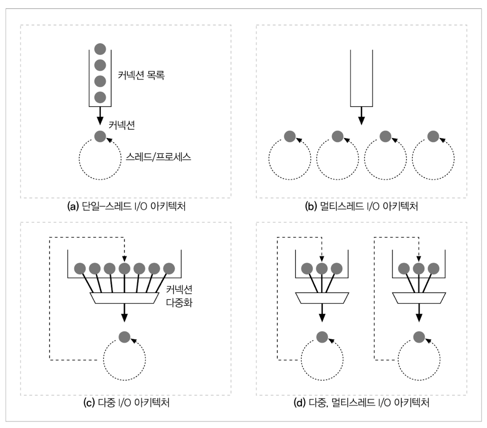
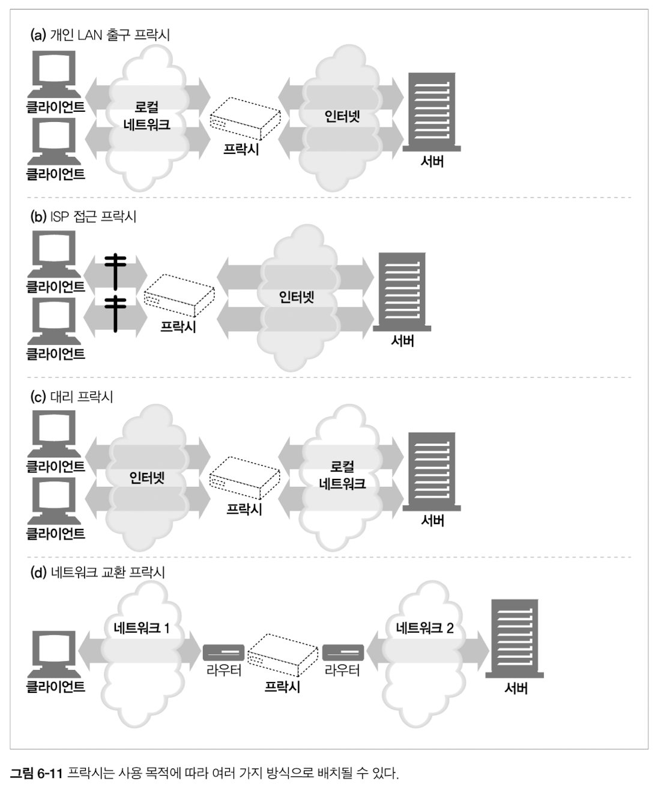

# Chapter 05 웹 서버

- 웹 서버 = 월드 와이드 웹의 일꾼
- 이 장에서 다룰 내용
  - 여러 종류의 소프트웨어 및 하드웨어 웹 서버에 대해 조사
  - HTTP 통신을 진단해주는 간단한 웹 서버 Perl로 작성
  - 어떻게 웹 서버가 HTTP 트랜잭션을 처리하는지 단계별로 설명
    공

## 5.1 다채로운 웹 서버

- 웹 서버 = HTTP 요청을 처리하고 응답 제공 = 리소스에 대한 HTTP 요청을 받아서 콘텐츠를 클라이언트에게 돌려줌
  - 자신이 제공하는 리소스를 관리
  - 웹 서버를 설정, 통제, 확장하기 위한 관리 기능 제공
  - ⇒ HTTP 프로토콜 구현 / 웹 소스 관리 / 웹 서버 관리 기능 제공 / TCP 커넥션 관리에 대한 책임을 운영체제와 나눠 가짐
    - 운영체제 = 컴퓨터 시스템의 하드웨어 관리, TCP/IP 네트워크 지원, 웹 리소스 유지를 위한 파일 스스템, 현재 연산 활동을 제어하기 위한 프로세스 관리 제공
- 다목적 소프트웨어 웹 서버
  - 마이크로소프트 웹 서버
  - 아파치 웹 서버
  - nginx 서버
- 간단한 펄 웹 서버
  - 완전한 기능을 갖춘 HTTP 서버
    - 아파치 웹 서버 코어
    - HTTP/1.1의 기능들을 지원하려면, 풍부한 리소스 지원, 가상 호스팅, 접근 제어, 로킹, 설정, 모니터링, 그 외 성능을 위한 각종 기능들이 필요
    - BUT, 최소한의 HTTP 서버 = 30줄 이하의 Perl 코드로 만들 수 있음! ⇒ 클라이언트와 프락시 간의 상호작용 테스트에 유용한 진단 툴 (HTTP 커넥션을 기다리고, 요청 메시지를 받으면 화면에 출력, 클라이언트에세 답할 내용을 기다리고 완료되면 응답 메세지를 다시 클라이언트에게 전달)
- 진짜 웹 서버가 하는 일
  

  1. 커넥션을 맺는다 - 클라이언트 커넥션 수락
     - 클라이언트 ⇒ 서버로 TCP 커넥션 요청 : 웹 서버 = 그 커넥션을 맺고, TCP 커텍션에서 IP 주소를 추출해 커넥션 맞은편에 어떤 클라이언트가 있는지 확인
     - 새 커넥션 맺어지고 받아들여지면, 서버는 새 커넥션을 커넥션 목록에 추가하고 커넥션에서 오가는 데이터를 지켜보기 위한 준비를 함
     - 웹 서버는 어떤 커넥션이든 마음대로 거절하거나 즉시 닫을 수 있음
     - 대부분읜 웹 서버는 **역방향 DNS**를 사용해 클라이언트의 IP 주소를 클라이언트의 호스트 명으로 변환하도록 설정
     - 웹 서버는 홍스트 명을 구체적인 접근 제어와 로깅을 위해 사용
     - **호스트명 룩업** = 사람이 읽을 수 있는 **호스트 이름(hostname)**을 컴퓨터가 통신에 사용하는 숫자 주소인 **IP 주소(IP address)**로 변환하는 과정
       - ⇒ 꽤 시간이 많이 걸릴 수 있어, 웹 트랜잭션을 느려지게 할 수 있음
     - 많은 대용량 웹 서버는 호스트 명 분석을 꺼두거나 특정 콘텐츠에 대해서만 켜놓음
     - IETF ident 프토토콜 - 서버에게 어떤 사용자 이름이 HTTP 커넥션을 초기화했는지 찾아낼 수 있게 해줌 ⇒ 웹 서버 로깅에 유용
  2. 요청을 받는다 - 요청 메시지 수신
     - 커넥션에 데이터가 도착하면, 웹 서버는 네트워크 커넥션에서 그 데이터를 읽어 들이고 파싱하여 요청 메시지를 구성
     - 요청 메시지 파싱시 웹 서버가 하는 일
       1. 요청줄을 파싱하여 오청 메서드, 지정된 리소스의 식별자(URI), 버전 번호를 찾는다. 스페이스로 분리, CRLF 문자열로 끝남
       2. 메시지 헤더를 읽음. 각 헤더는 CRLF로 끝남
       3. 헤더의 끝을 의미하는 CRLF로 끝나는 빈 줄을 찾음
       4. 요청 본문이 있으면 읽어 들임(길이는 Content-Length 헤더로 정의됨)
     - 웹 서버는 파싱해서 이하하는 것이 가능한 수준의 분량을 확보할 때까지 데이터를 네트워크로부터 읽어서 메시지 일부분을 메모리에 임시로 저장해 둘 필요가 있음
     - 요청 메시지를 쉽게 다루기 위해 내부의 자료 구조에 저장
     - 고성능 웹 서버는 수천 개의 커넥션을 동시에 열 수 있도록 지원
     - 웹 서버는 항상 새 요청을 주시
       
       1. 단일 스레드 웹 서버
          - 한 번에 하나씩 요청을 처리 ⇒ 트랜잭션이 완료되면, 다음 커넥션이 처림
          - 처리 도중에 모든 다른 커넥션은 무시됨 ⇒ 심각한 성능 문제를 만듦 ⇒ 로드가 적은 서버, type-o-serve와 같은 진단도구에서만 적당
       2. 멀티프로세스와 멀티스레드 웹 서버
          - 여러 요청을 동시에 처리하기 위해 여러 개의 프로세스 혹은 고효율 스레드 할당
          - 수천, 수만 개의 동시 커넥션을 처리할 때 그로 인해 만들어진 수많은 프로세스나 스레드는 너무 많은 메모리나 시스템 리소스를 소비 ⇒ 최대 스레드/프로세스 개수 제한
       3. 다중 I/O 서버
          - 다중 아키텍처 ⇒ 모든 커넥션은 동시에 그 활동을 감시당함
       4. 다중 멀티스레드 웹 서버
          - 여러 개의 스레드는 각각 열려있는 커넥션을 감시하고 각 커넥션에 대해 조금씩 작업을 수행
  3. 요청을 처리한다 - 요청 처리
     - 웹 서버가 요청을 받으면, 서버는 요청으로부터 매서드, 리소스, 헤더, 본문을 얻어내어 처리
  4. 리소스에 접근한다 - 리소스의 매핑과 접근
     - 미리 만들어진 콘텐츠를 제공. 서버 위에서 동작하는 리소스 생성 애플리케이션을 통해 만들어진 동적 콘텐츠도 제공
  5. 응답을 만든다 - 응답 만들기
     - 한번 서버가 리소스를 식별하면, 서버는 요청 메서드로 서술되는 동작을 수행한 뒤 응답 메시지(응답 상태 코드, 응답 헤더, 응답 본문)를 반환
     - 응답 엔터티
       - 응답 본문의 MIME 타입을 서술하는 Content-Type 헤더
       - 응답 본문의 길이를 서술하는 Content-Length 헤더
       - 실제 응답 본문의 내용
     - 리다이렉션 : 브라우저가 다른 곳으로 가도록. 3XX 상태코드. Location 응답 헤더는 콘텐츠의 새로운 혹은 선호하는 위치에 대한 URI를 포함
       - 영구히 리소스가 옮겨진 경우
       - 임시로 리소스가 옮겨진 경우
       - URL 증강
       - 부하 균형
       - 친밀한 다른 서버가 있을 때
       - 디렉터리 이름 정규화 - URI 요청 끝에 /을 빠뜨렸다면, 대부분의 웹 서버에서 상대 경로가 정상적으로 동작하도록 클라이언트를 슬래시를 추가한 URI로 리다이렉트
  6. 응답을 보낸다
     - 서버는 커넥션 상태를 계속해서 추적, 지속적인 커넥션은 특별히 주의가 필요
  7. 트랜잭션을 로그로 남긴다

# Chapter 05 프락시

- 웹 프락시 서버 = 중개자 ⇒ 클라이언트와 서버 사이에 위치. 그들 사이의 HTTP 메시지를 정리하는 중개인처럼 동작
- 이 장에서 다룰 내용

  - HTTP 프락시 VS 웹 게이트웨이, HTTP 프락시가시가 어떻게 배치되는지
  - 활용 방법
  - 프락시가 실제 네트워크에 어떻게 배치되어 있는지, 트래픽이 어떻게 프락시 서버로 가게 되는지
  - 브라우저에서 프락시를 사용하려면 어떻게 설정해야하는지
  - HTTP 프락시 요청이 서버 요청과 어떻게 다른지, 프락시가 어떻게 브라우저의 동작을 미묘하게 바꾸는지
  - 일련의 프락시 서버들을 통과하는 메시지의 경로를, Via 헤더와 TRACE 메서드를 이용해 기록하는 방법
  - 프락시에 기반한 HTTP 접근 제어
  - 어떻게 프락시가 클라이언트와 서버 사이에서 각각의 다른 기능과 버전 들을 지원하면서 상호작용 할 수 있는지

- 프락시
  - 웹 클라이언트에서 볼 때 서버처럼 동작하면서, 요청 메시지를 받고 응답 메시지를 돌려줌
  - 웹 서버에서 볼 때 웹 클라이언트처럼 동작하면서, 웹 요청 메시지를 보내고 웹 응답 메시지를 받음
  - 개인 프락시 / 공유 프락시(여러 클라이언트가 함께 사용)
- 프락시 VS 게이트웨이
  - 프락시 = 같은 프로토콜을 사용하는 둘 이상의 애플리케이션을 연결
  - 게이트웨이 = 서로 다른 프로토콜을 사용하는 둘 이상을 연결 ⇒ 클라이언트와 서버가 서로 다른 프로토콜로 말하더라도 서로 간의 트랙잭션을 완료할 수 있도록 해주는 프로토콜 변환기처럼 동작
- 왜 프락시를 사용하는가?
  - 보안 개선, 성능 향상, 비용 절약, 트래픽 감시/수정
  - 예. 어린이 필터, 문서 접근 제어자, 보안 방화벽, 웹 캐시
    - 대리 프락시(Surrogate, = 대리/리버스 프락시, 느린 웹 서버의 성능을 개선하기 위해 사용됨)
    - 콘텐츠 라우터(인터넷 트래픽 조건과 콘텐츠 종류에 따라 요청을 특정 웹 서버로 유도)
    - 트랜스코드(콘텐츠를 클라이언트에게 전달하기 전에 본문 포맷을 수정) ⇒ 크기를 줄이기 위해, 압축 등
    - 익명화 프락시(Anonymizer, HTTP 메시지에서 신원을 식별할 수 있는 특정을 적극적으로 제거해 개인정보보호와 익명성 보장에 기여)
- 프락시는 어디에 있는가?
  - 어떻게 네트워크에 배치되는가?
    
    - 사용 용도에 따라 어디에든 배치 가능
      - 출구(Egress) 프락시 : 로컬 네트워크의 출구에 위치, 로컬 네트워크 - 더 큰 인터넷 사이를 오가는 트래픽 제어
        - 회사 밖의 악의적인 해커들을 막는 방화벽을 제공
        - 이터넷 요금 절약 / 인터넷 트래픽의 성능을 개선
        - 부적절한 콘텐츠 필터링
      - 접근(입구) 프락시
        - ISP 접근 지점, 고객으로부터의 모든 요청을 종합적으로 처리하기 위해
          - **ISP** : 사용자들의 다운로드 속도 개선
          - **캐시 프락시** : 인터넷 대역폭 비용을 줄이기 위해, 많이 찾는 문서들의 사본 저장
      - 대리 프락시
        - 네트워크의 가장 끝에 있는 웹 서버들의 바로 앞에 위치. 웹 서버로 향하는 모든 요청을 처리하고 필요할 때만 웹 서버에게 자원을 요청
        - 웹 서버에 보안 기능 추가
        - 빠른 웹 서버 캐시를 느린 웹 서버의 앞에 놓아 성능 개선
      - 네트워크 교환 프락시 : 캐시를 잉요해 인터넷 교차로의 혼잡을 완화하고 트래픽 흐름을 감시하기 위해. 충분한 처리 능력을 갖춘 프락시가 네트워크 사이의 인터넷 비어링 교환 저짐들에 놓일 수 있음
  - 어떻게 프락시의 연쇄가 계층을 이루는가?
    - 프락시 계층 : 메시지는 최종적으로 원 서버에 도착할 때까지 프락시와 프락시를 거쳐 이동 ⇒ 프락시 계층 내 프락시 서버들은 부모-자식 관계를 가짐
      - 인바운드 프락시(서버에 가까운 쪽) = 부모
      - 다은번 아웃바운드 프락시(클라이언트에 가까운 쪽) = 자식
    - 프락시 계층 콘텐츠 라우팅 - 정적 & 동적 모두 가능
    - 정적 프락시 계층
    - 동적 프락시 계층 : 여러 가지 판단 근거에 의해 메시지를 다양하고 유동적인 프락시 서버와 원 서버들의 집합에게 보낼 수 있음
      - 상황에 맞춰 부모 프락시나 원 서버에게 라우팅
      - ⇒ 부하 균형, 지리적 인접성에 근거한 라우팅, 프로토콜/타입 라우팅, 유료 서비스 가입자를 위한 라우팅
  - 어떻게 트래픽이 올바르게 프락시를 찾아가는가?
    - 어떻게 프락시가 트래픽을 처리하는가
      - 클라이언트 트래픽이 프락시로 가도록 만드는 방법
        1. 클라이언트 수정
           - 구글 크롬 등 많은 웹 클라이언트들은 수동/자동 프락시 설정 지원 ⇒ 클라이언트는 HTTP 요청을 바로 / 의도적으로 원 서버가 아닌 프락시로 보냄
        2. 네트워크 수정
           - 클라이언트가 모르게, 네트워크 인프라를 가로채 웹 트래픽을 프락시로 가도록 조정 ⇒ HTTP 트래픽을 지켜보도 가로채어 클라이언트 모르게 트래픽 프락시로 보내는 스위칭 장치와 라우팅 장치가 필요함(= 인터셉트 프락시, transparent proxy)
        3. DNS 이름 공간 수정
           - 대리 프락시를 사용해, 웹 서버의 이름과 IP 주소를 자신이 직접 사용함 ⇒ 모든 요청은 서버 대신 대리 프락시로 가게 됨
           - DNS 이름 테이블을 수동으로 편집하거나 사용할 적절한 프락시나 서버를 계산해주는 특별한 동적 DNS 서버를 이용해 조정도 가능
        4. 웹 서버 수정
           - HTTP 리다이렉션 명령(응답 코드 305)를 클라이언트에게 돌려줘, 클라이언트 요청을 프락시로 리다이렉트 하도록 설정
- 클라이언트 프락시 설정

  - 수동 설정
  - 브라우저 기본 설정 : 브라우저를 소비자에게 전달하기 전에 프락시를 미리 설정
  - 프락시 자동 설정(Proxy auto-configuration, PAC 파일) : JS 프락시 자동 설정 파일에 대한 URI 제공 ⇒ 클라이언트가 프락시를 써야하는지, 써야한다면 어떤 프락시 서버를 써야하는지 판단하기 위해 JS 파일을 가져와 실행
    - JS PAC 파일의 URI를 브라우저에 설정 ⇒ 브라우저는 URI로부터 파일을 가져오 매 접근마다 적절한 프락시 서버를 계산하기 위해 JS 로직 이용
      - .pac 확장자, MIME type = 'application/x-ns-proxy-autoconfig'
      - 각 PAC파일은 반드시, 사용할 적절한 프락시 서버를 계산해주는 FindProxyForUrl(url, host)라는 함수를 정의해야함
  - Web Proxy Autodiscovery Protocol(WPAD) : 대부분의 브라우저에서 제공
    - 여러 발견 매커니즘들의 상승 전략을 이용해 브라우저에게 알맞은 PAC 파일을 자동으로 찾아주는 알고리즘
    - WPAD 프로토콜이 구현된 클라이언트가 하게 될 일
      - PAC URI를 찾기 위해 WPAD를 사용
      - 주어진 URI에서 PAC 파일을 가져옴
      - 프락시 서버를 알아내기 위해 PAC파일 실행
      - 알아낸 프락시 서버를 이용해 요청 처리

- 프락시 요청의 미묘한 특징들

  - 프락시 요청의 URI는 서버 요청과 어떻게 다른가?
  - 인터셉트 프락시와 리버스 프락시는 어떻게 서버 호스트 정보를 알아내기 어렵게 만드는가?

    - 웹 서버 메시지 문법 = 웹 프락시 메시지 문법
    - BUT, 클라이언트가 프락시 대신 서버로 요청을 보내면 요청의 URI가 달라짐
      - 클라이언트 ⇒ 웹 서버 요청 시, 요청줄은 *스팀, 호스트, 포트번호가 없는 부분 URI*를 가짐
      - 클라이언트 ⇒ 프락시로 요청 시, 요청줄은 *완전한 URI*를 가짐
    - 왜 요청 형식이 다른가?
      - 초기 설계에는 단일 서버와 직접 대화했으나, 프락시가 부상하면서 부분 URI는 문제가 됨
        - ⇒ 프락시는 목적지 서버와 커넥션을 맺기 위해 서버 이름을 알아야 함 + 프락시 기반 게이트웨이는 FTP 리소스나 그 외 스킴을 연결하기 위해 URI의 스킴을 알아야 함
        - ⇒ 가상 호스팅에서도 동일한 문제 발생
        - [***주의***] 대리 프락시, 인터셉트 프락시에서는 부분 URI를 받게 됨
    - 다목적 프락시 서버 = 요청 메시지의 완전한 URI와 부분 URI를 모두 지원해야함

  - URI 수정에 대한 규칙
  - 프락시는 브라우저의 똑똑한 URI 자동완성이나 호스트 명 확장 기능에 어떻게 영향을 주는가?
    - 프락시 서버는 최대한 관대해야함. 기존에 잘 동작하던 동작을 망가뜨리지 않기 위해
    - 프락시가 없다면 사용자가 타이핑한 URI를 가지고 대응하는 IP주소를 찾고 연결
    - 호스트를 찾지 못하면, 자동화된 호스트 명의 확장을 제공하고자 아래를 시도
      - www. 등을 자동으로 붙여주는 등
      - 호스트명 분석(Hostname Resolution) - 오타 교정, 호스트명 앞부분만 입력하면 자동으로 도메인 검색
    - ⇒ 프락시 없는 URI 분석
    - 명시적인 프락시를 사용할 때의 URI 분석
      - 부분 호스트명 자동 확장 X
    - 인터셉트 프락시를 이용한 URI 분석
      - 인터셉트 프락시와 명시적인 프락시 모두 죽은 서버의 DNS 분석에 대한 장애 허용을 지원해야함 ⇒ 브라우저가 명시적인 프락시를 사용하도록 설정된 경우 장애 허용은 프락시에게 달려있기 때문

- 메시지 추적

  - Via 헤더

    - 메시지가 지나는 각 중간 노드의 정보를 나열
    - 메시지가 또 다른 노드를 지날 때마다, 중간 노드는 Via 목록의 끝에 반드시 추가되어야 함
    - 메시지의 전달을 추적하고, 메시지 루프를 진단하고, 요청을 보내고 그에 대한 응답을 돌려주는 과정에 관여하는 모든 메시지 발송자들의 프로토콜을 다루는 능력을 알아보기 위해 사용 됨
    - 프락시가 네트워크 라우팅 루프를 탐지하기 위해 사용하기도 함
    - Via 문법
      - Via 헤더 필드는 쉼표로 구분된 경유지(waypoint)의 목록임. 각 격유지는 개별 프락시 서버나 게이트웨이 홉을 나타냄
      - 각 Via waypoint = 프로토콜 이름, 프로토콜 버전, 노드 이름, 코멘트로 구성
    - Via와 게이트웨이
      - 몇몇 프락시는 서버에게 비 HTTP 프로토콜을 사용할 수 있는 게이트웨이 기능을 제공
      - Via 헤더는 이러한 프로토콜 변환을 기록하므로 HTTP 애플리케이션은 프락시 연쇄에서 프로토콜 능력과 변환이 있었는지를 알아챌 수 있음
    - 응답 메시지가 프락시를 통과할 때, 프락시는 Server 헤더(원 서버에 의해 사용되는 소프트웨어를 알려줌)를 수정해서는 안 됨

  - TRACE 메서드
    - HTTP/1.1의 TRACE 메서드 = 요청 메시지를 프락시의 연쇄를 따라가면서 어떤 프락시를 지나가고 어떻게 각 프락시가 요청 메시지를 수정하는지 관찰/추적할 수 있도록 해줌

- 프락시 인증

  - 프락시는 접근 제어 장치로서 제공될 수 있음 ⇒ 서버 - 407 Proxy Authorization Required 상태 코드, 클라이언트 - Proxy-Authorization 헤더 필드

- 프락시 상호운용성
  - 지원하지 않는 헤더와 메서드 다루기 ⇒ 반드시 그대로 전달해야함
  - HTTP OPTIONS 메서드 : 서버나 웹 서버의 특정 리소스가 어떤 기능을 지원하는지 클라이언트가 알아볼 수 있게 해줌
    - Allow 헤더 : 요청 URI에 의해 식별되는 자원에 대해 지원되는 메서드들이나 서버가 지원하는 모든 메서드를 열거
      - 새 리소스가 지원했으면 하는 메서드를 추천하기 위해 요청 헤더로 사용될 수 있음
      - 프락시는 Allow 헤더 필드를 수정할 수 없음

# Questions

- 왜 index.html이 기본 색인 파일인가?
- 웹 빌드 후 어떻게 동작하는가?
- 크롬 새 시크릿 탭은 익명화 프락시를 사용하는 건가?
- ISP?
- 가상 호스팅 웹 서버?
