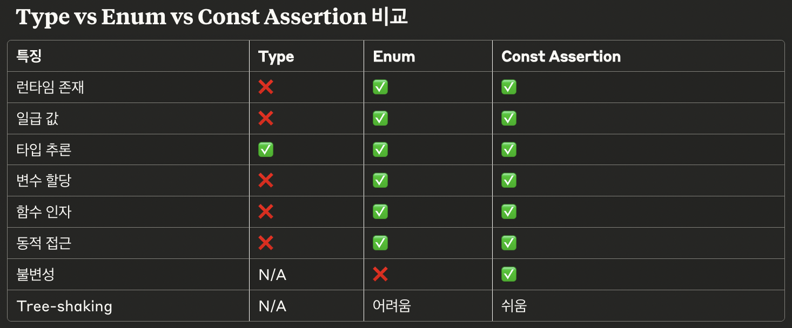

# CHAPTER 8 계층형 설계 I

- 소프트웨어 설계: 코드를 만들고, 테스트하고, 유지보수하기 쉬운 프로그래밍 방법을 선택하기 위해 미적 감삭을 사용하는 것
  - 이 장에서, 계층형 설계(stratified design)을 사용
    - 각 계층에 있는 함수는 바로 아래 계층에 있는 함수를 이용해 정의
    - 다양한 입력 : 함수 본문, 계층 구조, 함수 시그니처
    - 다양한 출력 : 조직화, 구현, 변경 (p. 170)

## 계층형 설계 패턴

1. 직접 구현
   - 함수 시그니처가 나타내고 있는 문제를 한수 본문에서 적절한 구체화 수준에서 해결
2. 추상화 벽
   - 호출 그래프에 어떤 계층이 중요한 세부 구현을 감추고 인테페이스를 제공
   - 인터페이스를 사용해 높은 차원으로 생각 가능. 고수즌의 추상화 단계만 생각하면 되서 두뇌 용량의 한계를 극복 가능
3. 작은 인터페이스
   - 비스니스 개념을 나타내는 중요한 이터페이스는 작고 강력한 동작으로 구성
   - 다른 동작도 직간접적으로 최소한의 인터페이스를 유지하며 정의 필요
4. 편리한 계층
   - 개발자의 요구를 만족시키면서 비즈니스 문제를 잘 풀 수 있어야 함

## 요약 정리

- 계층형 설계: 코드를 추상화 계층으로 구성. 각 계층을 볼 때 다른 계층에 구체적인 내용을 몰라도 됨
- 문제 해결을 위한 함수 구현 시, 어떤 구체화 단계로 쓸지 결정하는 것이 중요 → 함수가 어떤 계층에 속하는지 알기 위해
  - 함수가 어떤 계층에 속하나? 함수 이름, 본문, 호출 그래프 등으로 구분할 수 있음
- 함수 이름 = 의도 → 비슷한 목적의 이름을 가진 함수를 함께 묶을 수 있음
- 함수 본문 = 중요 세부 사항 → 함수가 어떤 계층 구조에 있어야 하는지 알려줌
- 호출 그래프 = 구현이 직접적이지 않다는 것을 파악 가능 → 함수 호출 화살표 길이가 다양하다면 직접 구현 X
- 직접 구현 패턴 : 함수를 명확하고 아름답게 구현해 계층을 구성할 수 있도록 알려줌

# CHAPTER 9 계층형 설계 II

## 요약 정리

- 추상화 벽 패턴: 세부적인 것을 완벽히 감출 수 있어, 더 높은 차원에서 생각 가능
  - 추상화 벽: 세부 구현을 감춘 함수로 이루어진 계층 → 구현을 몰라도 함수 사용 가능 → 추상화 벽 아래에 있는 코드와 위에 있는 코드의 의존성을 없앰
    - → 계층 구조에서 어떤 게층에 있는 함수들이 잠바구니와 같이 공통된 개념을 신경 쓰지 않아도 된다면 그 계층을 추상화 벽이라 할 수 있음
    - → 추상화 벽 위에 있는 함수를 사용하는 사람에게 장바구니 구조 등 구체적인 구현을 신경쓰지 않아도 됨
  - 언제 사용해야하나?
    1. 쉽게 구현을 바꾸기 위해
    2. 코드를 읽고 쓰기 쉽게 만들기 위해
    3. 팀 간에 조율해야 할 것을 줄이기 위해
    4. 주어진 문제에 집중하기 위해
    - 추상화 벽의 핵심 질문
      1. 어느 부분을 신경 쓰지 않도록 만들면 좋을까요?
      2. 사람들이 몰라도 되면 좋은 것은 무엇일까요?
      3. 어떤 함수들이 비슷한 세부 사항을 신경 쓰지 않아도 되는 함수들일까요?
- 작은 인터페이스 패턴: 완성된 인터페이스에 가깝게 계층을 만들 수 있음 → 중요한 비즈니스 개념을 표현하는 인터페이스는 한번 잘 만들어 놓고 더 바뀌거나 늘어나지 않아야 함
  - 새로운 코드를 추가할 위치에 관한 것
    - 추상화 벽 위에 있는 계층에 만드는 것이 좋음 → 직접 구현에 가까움 (→ 시스템 하위 계층 코드가 늘어나지 않게 하기 위해)
  - 인터페이스를 최소화하면 하위 계층에 불필요한 기능이 쓸데없이 커지는 것을 막을 수 있음
  - → 새로운 긴으을 만들 때, 하위 계층에 기능을 추가하거나 고치는 것보다 상위 계층에 만드는 것이 작은 인터페이스 패턴!
- 편리한 계층 패턴: 다른 패터을 요구 사항에 맞게 사용 가능 완성된 인터페이스에 가깝게 계층을 만들 수 있음 → 너무 과한 추상화를 요구 사항에 맞게 적용 필요
  - 언제 패턴을 적용하고 또 언제 멈춰야하는지 알려줌
    - 지금 편리한가? → 작업하는 코드가 편리하다고 느껴지면 설계를 조금 멈춰도 됨
    - 구체적인 걸 너무 많이 알아야하거나, 코드가 지저분하다고 느껴지면 다시 패턴 적용
  - → 언제나 설계와 새로운 기능의 필요성 사이 어느 지점에서 중용을
- 호출 그래프 구조에서 규칙을 얻을 수 있음
  - 유지보수성: 위로 연결된 것이 적은 함수가 바꾸기 쉬움 → 자주 바뀌는 코드는 가능한 위쪽에 있어야 함
  - 테스트 가능성: 위쪽으로 많이 연결된 함수를 테스트하는 것이 더 가치 있음 → 아래쪽에 있는 함수를 테스트하는 것이 위쪽에 있는 함수를 테스트하는 것보다 가치 있음(위 쪽은 자주 변할 수 있고, 아래쪽은 많이 사용될 수 있어서)
  - 재사용성: 아래쪽에 함수가 적을수록 더 재사용하기 좋음 → 낮은 수준의 단계로 함수를 빼내면 재사용성이 더 높아짐

# Chapter 10 일급 함수 I

- 코드의 냄새: 함수 이름에 있는 암묵적 인자
  - 함수 구현이 거의 동일 & 함수 이름이 구현의 차이를 만
- 리팩터링: 암묵적 인자 드러내기

  1. 함수 이름에 있는 암묵적 인자 확인
  2. 명시적인 인자 추가

     - → 일급(first class)로 만듦!

       ```
       * 일급 값(First-class value)의 특징:

       변수에 할당 가능
       함수의 인자로 전달 가능
       함수의 반환값으로 사용 가능
       런타임에 생성 가능
       동등성 비교 가능
       ```

       ```
       ❓ Q. 타입스크립트에서 type, enum은 일급 값인가?
          - type 별칭: 일급 값이 아님 (런타임에 존재하지 않음)
            → const assertion으로 타입의 런타임 부재를 보완 가능
          - enum: 일급 값임 (런타임에 실제 객체로 존재함)

       ```

       

     - → 일반적인 엔티티(장바구니, 제품) = 일반적인 데이터 구조 사용 (호출 그래프의 가장 하단에 존재)
       - 데이터를 데이터 그대로 사용 가능 → 데이터 지향(data orientation, 이벤트와 엔티티에 대한 사실을 표현하기 위해 일반 데이터 구조를 사용하는 프로그래밍 형식)

  3. 함수 본문에 하드 코딩된 값을 새로운 인자로 바꿈
  4. 함수를 호출하는 곳을 고침듦

- 리팩터링: 함수 본문을 콜백으로 바꾸기
  1. 함수 본문에서 바꿀 부분의 앞부분과 뒷부분을 확인
  2. 리팩터링 할 코드를 함수로 뺌
  3. 빼낸 함수의 인자로 넘길 부분을 또 다른 함수로 뺌
  - → 일급 함수로 어떤 함수에 동작을 전달 가능 → 고차 함수(인자로 함수를 받거나 리턴값으로 함수를 리턴할 수 있는 함수)로 만들 수 있음!

## 함수 정의 방식

1.  전역적 정의
    - → 붙인 이름으로 프로그램 어디서난 쓸수 있음
2.  지역적 정의
    - → 지역적으로 쓰고 싶지만 이름이 필요할 때
3.  인라인 정의(익명 함수, anonymous function)
    - 콜백에서 인라인 함수로 정의 → 바로 실행되지 않게 하기 위해(🧊🐟)
    - JS에서 함수는 일급 → 변수 저장해 이름 붙이기/배열, 객체 등 자료구조에 보관 / 그냥 그대로 전달 가능
    - → 문맥에서 한 번만 쓰는 짧은 함수에 사용하면 좋음

# CHAPTER 11 일급함수 II

- 어떤 경우에는 리팩터링을 하고 나서 중복을 없애면 코드가 더 짧아짐
- 하지만, 더 길어지는 경우도 있음
  - 카피-온-라이트 함수(p. 272) 리팩토링의 장점
    - 표준화된 원칙
    - 새로운 동작에 원칙을 적용할 수 있음
    - 여러 개를 변경할 때 최적화

## 함수를 리턴하는 함수

- 로깅 함수: 리팩토링으로 중복 코드를 줄였지만, 여전히 중복 코드가 존재
  - 리팩토링 후 문제점
    1. 어떤 부분에 로그를 남기는 것을 깜빡할 수 있음
    2. 모든 코드에 수동으로 `withLogging()`을 적용해야함
  - → 에러를 잡아 로그를 남길 수 있는 기능이 추가된 함수를 일반 함수처럼 그냥 호출할 수 있길 원함
    - → 함수 팩토리
      1. 함수 이름을 명확하게 바꿈
      2. 함수 본문을 콜백으로 바꾸기 리팩토링 적용
      - → 함수를 리턴하는 함수 = 함수 팩토리 → 자동으로 정형화된 코드를 함수로 만들 수 있음

## 전체 프로그램을 고차함수로 만들면 안 되나요?

- 탐구와 실험이 필요. 다양한 목적으로 다양한 곳에 고차 함수를 적용해보고 직관적인 방법과 항상 비교해보기
  - 어떤 방법이 더 좋은가?
  - 코드가 더 읽기 쉬운가?
  - 얼마나 많은 중복 코드를 없앨 수 있나?
  - 코드가 하는 일이 무엇인지 쉽게 할 수 있나?
  - → 고차함수는 강력한 기능이지만 비용이 따름. 능숙하게 쓸 줄 알아야 하지만 더 좋은 코드를 만드는 데 써야함

# CHAPTER 12 함수형 반복

## map()

- 배열을 받아 하나씩 변환해서 같은 길이의 배열로 만들어주는 함수

## filter()

- 배열에서 일부 항목을 선택하는 함수

## reduce()

- 배열을 순회하면서 값을 누적
  - 값을 더할 수도, 해시 맵/문자열을 합칠수도 → 전달하는 함수를 통해 누정하는 방법 결정
  - 함수는 누적하고 있는 현재 값과 반복하고 있는 현재 배열의 항복을 인자로 받아 새로운 누적값을 리턴
  - 할 수 있는 것
    - 실행 취소/실행 복구
    - 테스트할 때 사용자 입력을 다시 실행하기
    - 시간 여행 디버깅
    - 회계 감사 추적

# CHAPTER 13 함수형 도구 체이닝

- 체이닝: 여러 단계를 하나로 조합하는 것

## 체인을 명확하게 만들기

- 체인의 각 단계는 원하는 결과에 가까워지도록 데이터를 한 단계씩 변환하는 단순한 동작
- 반복문을 함수형 도구 체인으로 리팩토링 가능

- 방법 1. 단계에 이름 붙이기
- 방법 2. 콜백에 이름 붙이기
- → 위 1, 2 방법을 비교 → 더 명확한 방법을 사용

- 스트림 결함(stream fusion): `map()`/`filter()`/`reduce()` 체인 최적화
  - 값 하나에 두 번 `map()` 호출 → `map()`을 한 번 호출
  - 갑 하나에 두 번 `filter()` 호출 → `filter()` 한 번 사용
  - `map()` 다음에 `reduce()` 사용 → `reduce()` 한 번 사용

## 반복문을 함수형 도구로 리팩터링하기

1. 데이터 만들기
   - 배열 일부에 대해 동작하는 방복문은 배열 일부를 새로운 배열로 나눌 수 있음
   - 함수형 도구를 사용해 작업 줄이기
2. 배열 전체를 다루기
   - 어떻게 하면 반복문 대신 전체 배열을 한 번에 처리할 수 있을지 고민 필요
   - `map()` - 모든 항복 변환
   - `filter()` - 항복을 없애거나 유지
   - `reduce()` - 항목을 하나로 합침
3. 작은 단계로 나누기
   - 알고리즘이 한 번에 너무 많은 일을 한다고 생각되면, 두 개 이상의 단계로 나누기 → 더 이해하기 쉬워짐
4. 조건문을 f`ilter()`로 바꾸기
5. 유용한 함수로 추출하기
6. 개선을 위해 실험하기

## 체이닝 디버깅을 위한 팁

- 구체적인 것을 유지하기
  - 의미를 기억하기 쉽게 이름 붙이기
- 출력해보기
  - 각 단계 사이에 print 구문을 넣어 예상한 대로 동작하는지 확인
  - 복잡한 체인은 한 번에 한 단계식 추가해 결과를 확인하고 다음 단계를 추가
- 타입을 따라가 보기
  - 각 단계를 지나는 값의 타입을 따라가기

## 다양한 함수형 도구

- `pluck()` - 배열에서 특정 필드값 가져오기
- `concat()` - 배열 안에 배열을 뺌 → 중첩된 배열을 한 단계의 배열로 만듦
- `frequenciesBy()`, `groupBy()` - 개수를 세거나 그룹화
